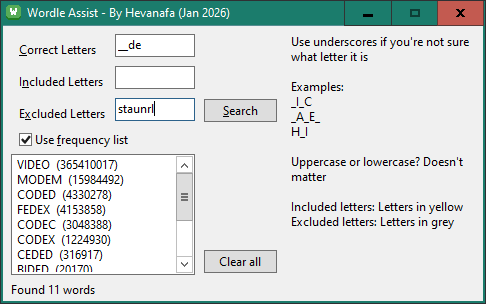

# Wordle Assist

A native desktop utility designed to crack the Wordle code. Using the speed of Lazarus and Pascal, this tool processes word lists alongside the frequency data to narrow down the most probable words based on the input clues

## Requirements

- Lazarus IDE (v3.6 at the time of writing)
- The word list `TWL06.txt` obtained from [jessicatysu/scrabble](https://github.com/jessicatysu/scrabble)
- The frequency list `count_1w.txt` obtained from [Peter Norvig's most frequent English words](https://norvig.com/ngrams/count_1w.txt)
- Perl to build the word lists

## Building

- Build the word lists with Perl: `build_wordlist.pl` and `build_freqlist.pl`
- Make sure `words_5letters.txt` and `freqlist_5letters.txt` are already built
- Open `project.lpi` with Lazarus IDE
- Change build mode to Release
- Build & Run
