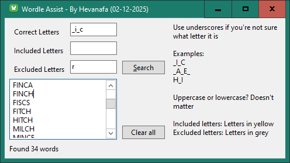

#

## Requirements

- Lazarus IDE (v3.6 at the time of writing)
- The word list `TWL06.txt` obtained from [jessicatysu/scrabble](https://github.com/jessicatysu/scrabble)
- The frequency list `count_1w.txt` obtained from [Peter Norvig's most frequent English words](https://norvig.com/ngrams/count_1w.txt)
- Perl to build the word lists

## Building

- Make sure `words_5letters.txt` is already built
- Open `project.lpi` with Lazarus IDE
- Change build mode to Release
- Build & Run
